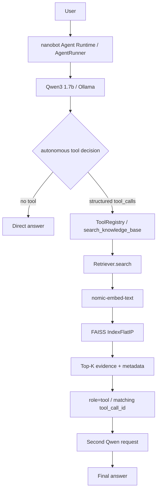

# RAG-Enhanced Knowledge Base Agent with Tool Calling

一个用于学习与面试讲解的本地 Agentic RAG 项目：将有来源记录的 RAG 组件改编为 Retriever，通过 nanobot 外部只读工具接入 Qwen，并分层评估检索、工具路由与最终回答。

V1 标识：`v0.1-agentic-rag-baseline`。**9 个虚构资料块、30 道检索题、24 道路由题的小规模自建 baseline；不是生产级系统，也不是大规模性能结论。** 本仓库不包含个人 Provider 配置、密钥或本地二进制索引。

## Project Overview
普通问题可以直接回答；依赖私有资料的问题由模型自主决定是否调用 `search_knowledge_base`。工具只返回证据，最终回答由 Qwen 生成。FAISS 总会返回近邻，Top-K 或高 score 不代表有答案。

## Architecture


## Key Features
- PDF/TXT loader、fixed chunking、稳定 chunk ID 与 source/page。
- 真实 Ollama Embedding、动态向量维度、L2 归一化及非法向量检查。
- IndexFlatIP、metadata 持久化与一致性校验；score 越大越相似。
- `Retriever.search(query, top_k=3) -> list[SearchResult]`，不调用生成模型、不设置阈值。
- `nanobot.tools` entry point 注册只读 Tool；返回 rank/text/source/chunk_id/score/page。
- 真实 structured tool calling、自主路由 baseline、无答案拒答和 bad-case 记录。

## Tech Stack
Python ≥3.11（实测3.12.14）、Ollama、Qwen3:1.7b、nomic-embed-text、NumPy、FAISS、PyMuPDF、tiktoken、httpx、PyYAML、pytest、nanobot 0.3.5。

## How It Works
入库：`extractor → chunk_fixed → embed_texts → FAISS build → metadata/index_info`。
检索：`query → embed_query → normalized inner product → Top-K → SearchResult`。
Agent：`AgentRunner → OpenAICompatProvider → model tool_calls → execute_tool_calls → ToolResult → role=tool → model answer`。
`cl100k_base` 只是切块计量工具，不是 Qwen 或 nomic 的真实 tokenizer。

### 本项目与上游边界
- **nanobot 提供** Agent runtime、AgentRunner、ToolRegistry 与 structured tool execution；本项目未修改其 core。
- **两个 MIT RAG 项目提供**部分 loader/chunker/FAISS/embedding 实现基础，并非本项目从零原创。
- **本项目完成**组件适配、Ollama Embedding 集成、IndexFlatIP 改造、统一 Retriever/SearchResult、外部知识库工具、插件集成、分层评估和 bad-case 分析。
详见 [第三方归属](THIRD_PARTY_NOTICES.md)。

## Installation
项目要求 Python **>=3.11**；V0.1 实际验证环境为 **Python 3.12.14**。以下 `py -3.12` 是推荐的已验证复现版本，不意味着 3.11 不受支持；使用 3.11 时可相应调整 Python 启动命令。

以下以 Windows PowerShell 为例，在一个通用工作目录操作。先安装 Python ≥3.11、Git；nanobot source install 还需要 [Bun 官方安装](https://bun.sh/docs/installation)。[Ollama 官方 Windows 安装](https://ollama.com/download/windows) 后启动 Ollama，验证 `ollama --version`。不要将模型文件放入本项目。

```powershell
# 从空工作目录开始；两个仓库保持相邻，nanobot 固定到验证过的 commit
 git clone https://github.com/tyh545259216-source/rag-enhanced-knowledge-base-agent.git knowledge-base-agent
 git clone https://github.com/HKUDS/nanobot.git nanobot
 git -C nanobot checkout 66f5f2df15455b34fc22e656bdc1ef3d4f32e328
 py -3.12 -m venv nanobot/.venv
 & ./nanobot/.venv/Scripts/python.exe -m pip install -e ./nanobot
 & ./nanobot/.venv/Scripts/python.exe -m pip install -e './knowledge-base-agent[test]'
 ollama pull qwen3:1.7b
 ollama pull nomic-embed-text
 ollama list
```
两个包必须装进**同一运行环境**，否则 entry point 无法发现。`requirements-tested.txt` 记录 RAG 独立环境实测依赖快照，不是完整 nanobot 锁文件；初次依赖解析仍需要网络。模型 tag 可变，实测 digest 在 [V1 manifest](docs/releases/V1_BASELINE.json)。

## Build Knowledge Base
```powershell
cd knowledge-base-agent
& ../nanobot/.venv/Scripts/python.exe -m knowledge_base_agent.ingest --config config.yaml
& ../nanobot/.venv/Scripts/python.exe -m pytest tests -q -p no:cacheprovider
& ../nanobot/.venv/Scripts/python.exe -B scripts/verify_plugin.py
```
默认配置只指向 `data/`、`store/` 和本地 Ollama。三个索引文件可重建，不上传二进制。现有9份TXT资料均虚构；不要把公司或个人私有文件加入公开仓库。

## Run Agent
在 `knowledge-base-agent/` 目录执行：
```powershell
./scripts/start_agent.ps1
```
脚本按自身位置定位项目，默认使用相邻 `nanobot/.venv/Scripts/python.exe`。不安装依赖、不重建索引、不修改 Provider 配置；启动期间设置知识库配置路径，结束后恢复调用 shell 的环境和工作目录。
```powershell
# 非默认目录：任选覆盖方式，相对参数以调用时目录为基准
./scripts/start_agent.ps1 -NanobotPath ../nanobot
./scripts/start_agent.ps1 -PythonExecutable ../nanobot/.venv/Scripts/python.exe
# 仅验证环境、entry point和索引文件存在，不启动服务
./scripts/start_agent.ps1 -CheckOnly
# 手动备用命令（在本项目目录运行）
& ../nanobot/.venv/Scripts/python.exe -m nanobot webui
```
若执行策略阻止脚本，请遵循组织规则或使用手动命令，无需修改全局执行策略。
在 WebUI 手动创建显示名 `qwen` 的模型预设：Provider `ollama`，实际 model `qwen3:1.7b`，API base `http://localhost:11434/v1`。无需 OpenAI OAuth，勿更改其他 Provider。首次本地 UI 密码按 nanobot 启动日志获取，不提交任何用户配置。

插件安装后必须启动新 nanobot 进程。下列脚本验证 discovery/schema/direct call，并只开放知识库工具执行固定烟雾题，不启动另一套 Agent loop：
```powershell
& ../nanobot/.venv/Scripts/python.exe -B scripts/verify_plugin.py
& ../nanobot/.venv/Scripts/python.exe -B scripts/agent_smoke.py
```
输出到忽略的 `artifacts/`，不会覆盖历史 baseline。烟雾脚本使用 `qwen` 预设和固定通用 instruction；前三题自主路由，第四题明确调用工具以验证 structured transport。WebUI 的默认完整上下文和其他内置工具与此受控评估不同，不能直接声称同样指标。

## Evaluation
### Frozen historical metrics
以下数字来自已冻结的 V0.1 历史评估，不由新的本地运行自动替换。
- Retrieval：20道有答案（15单块、5多块）+10道无答案；HitRate@3 **100%**、Recall@3 **97.5%**、MRR@3 **0.925**。无答案不计入这三个指标。
- Routing：24题、每类6题；Accuracy **87.50%**、Precision **100%**、Recall **83.33%**、F1 **90.91%**。
- Answer：18道私有问题；核心正确 **88.89%**、严格 groundedness **83.33%**；6道无答案拒答 **100%**，但只有4道先检索再拒答。
- 单次Agent工具调用E2E均值58.53秒，无工具25.82秒；不是吞吐量或生产SLA。
人工标注、按资料编题、小样本且非独立留出集，不能外推到大语料、多工具或生产可靠性。[完整评估](docs/EVALUATION.md)、[脱敏证据](docs/evidence/README.md)。

### 如何重新运行评测（new local run outputs）
先完成模型安装与索引构建，在本项目目录运行现有正式脚本：
```powershell
# Retrieval：30题，每题默认3次；只输出新本地结果
& ../nanobot/.venv/Scripts/python.exe -B scripts/evaluate_retrieval.py --config config.yaml --repeats 3
# 插件 discovery、schema、直接调用及错误处理
& ../nanobot/.venv/Scripts/python.exe -B scripts/verify_plugin.py
# Agent smoke / demo：3题自主路由 + 1题forced structured transport
& ../nanobot/.venv/Scripts/python.exe -B scripts/agent_smoke.py
```
新产物分别为 `artifacts/retrieval_recheck.json`、`artifacts/plugin_*.json`、`artifacts/v1_smoke/`，均被 Git 忽略；重复运行可能覆盖这些**本地新产物**，需要留档时先复制到另一个本地目录。不会覆盖 `docs/evidence/` 的 frozen historical metrics 或 Phase 1–3 原始记录。

Retrieval 脚本检查索引指纹与 golden 一致性；不一致时停止，不要编辑 golden 或旧 baseline 绕过。插件验证也核对固定来源与分数；模型 tag、依赖或数据变化可能影响重建一致性。

完整24题 Agent benchmark 成本高于 smoke，安装时不必每次重跑。Phase 3B 完整 trace 和过程脚本保留在 `docs/evidence/phase3b/`，属于历史证据，不是跨机器直接运行的正式入口；当前快速验证入口是上述 smoke。新 smoke 不替代或重算完整 benchmark 指标。

历史 audit 与 phase records 保留生成时的仓库状态；“tag 尚未创建”等表述是历史快照，不代表当前仓库状态。
Historical audit and phase records preserve the repository state at the time they were generated; statements such as “tag not yet created” are historical snapshots and do not describe the current repository state.

## Demo
三个代表性题目及**实际**调用 trace 见 [DEMO](docs/DEMO.md)。Aurora 题历史上曾误读负责人；演示不隐藏失败、不保证每次生成相同。

## Bad Cases
项目负责人与验收负责人误读、预算/日志问题漏路由、未检索却声称“知识库未找到”、高相似度无答案、证据概括错误。[完整案例](docs/BAD_CASES.md)。

## Project Structure
```text
src/knowledge_base_agent/  # vendor改编层、rag统一层、tools插件
 data/                    # 9份虚构资料
 store/                   # 本地重建索引，Git忽略
 eval/                    # golden与检索评估函数（原始baseline本机保留）
 tests/                   # 单元及真实Embedding集成测试
 scripts/                 # 可移植验证/评估入口
 docs/evidence/           # 公开脱敏历史证据
 docs/releases/           # V1版本/冻结/安全审计记录
 licenses/                # 上游MIT原文
 artifacts/               # 新运行产物，Git忽略
```

## Third-Party Attribution
本项目新增连接代码采用 MIT；vendor 改编保持上游版权和完整许可。nanobot 单独依赖，不声称其框架原创。参见 [LICENSE](LICENSE)、[THIRD_PARTY_NOTICES.md](THIRD_PARTY_NOTICES.md)、`licenses/`。

## Limitations
小语料、单知识库工具、一次24题路由实验；生成存在随机性与解释错误。高score不是答案置信度，无经校准阈值。PDF不含OCR。三文件索引不是事务式发布；不支持增量索引。默认插件路径依赖源码editable安装，非轮子独立数据部署。source install需要Bun，模型首次加载可能较慢。

## Future Work
只列计划，V1未实现：larger corpus、reranker、hybrid retrieval、MCP、LangGraph comparison、stronger model、routing optimization。
