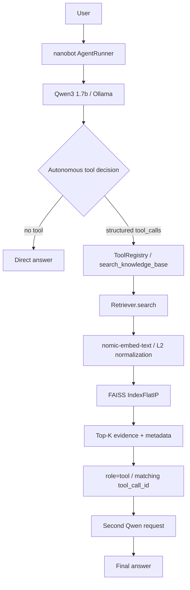

# RAG-Enhanced Knowledge Base Agent with Tool Calling

一个本地 Agentic RAG 项目：将有来源记录的 RAG 组件适配为 Retriever，通过 nanobot 外部只读工具接入 Qwen，并用对照实验区分检索、路由与最终答案质量。

**V0.2 是 experimental evaluation release：small synthetic benchmark，not production-scale。所有百分比都限定于下文的固定测试集，不代表生产可靠性。** V0.1 保留为 `v0.1-agentic-rag-baseline`；V0.2 不重写架构，不改变默认 Retriever/Tool/Provider，也不修改历史结果。

## Project Overview

普通问题可以直接回答；私有资料问题由模型决定是否调用 `search_knowledge_base`。工具返回证据与来源，Qwen 再生成答案。检索到近邻不等于存在答案，路由正确也不等于答案正确。

核心接口：`Retriever.search(query, top_k=3) -> list[SearchResult]`；工具返回 rank/text/source/chunk_id/score/page，不调用生成式 LLM。

## Architecture



这是**默认 Dense 链路**。BM25/Hybrid 与 A0/A1/A2 是隔离的实验实现/配置，没有将 Hybrid 或 A2 instruction 写入默认 WebUI/Tool。PDF/TXT、fixed chunking、metadata/index persistence 与非法向量检查来自 V0.1；`cl100k_base` 仅用于切块计量，不是 Qwen/nomic 的真实 tokenizer。

## V0.1 — Frozen Functional Baseline

9 个虚构资料块、30 道检索题、24 道路由题，验证了外部插件、真实 structured tool calling、自主工具决策与分层评估。历史 Retrieval Recall@3 为 97.5%，Routing Accuracy 为 87.5%；这些是 V0.1 自建 baseline，不能与 V0.2 不同语料/留出集直接比较。

[V0.1 evaluation](docs/EVALUATION.md) · [V1 manifest](docs/releases/V1_BASELINE.json) · [Demo](docs/DEMO.md) · [V0.1 bad cases](docs/BAD_CASES.md)

## V0.2 Experimental Findings

从“链路能运行”推进到“用冻结数据检验选择是否有效”：40 个独立虚构文档/40 chunks，Retrieval 60 题（dev 36/test 24），Routing 50 题（dev 30/test 20）；按主题组划分，test 不参与调参。

- **Retrieval**：Hybrid Recall@3 **97.5%**；BM25 MRR@3 **0.8917**。Hybrid 在本次测试中的 Top-K evidence coverage 较好，但 first-relevant ranking/MRR 未全面胜过 BM25。
- **Routing**：A0 **15/20（75%）→ A2 20/20（100%）**，仅限 20 条 frozen synthetic test queries。A2 由 dev 选择并冻结；仅改 Tool Description 的 A1 在 dev 反而下降，负结果保留。
- **Ablation**：Direct **7/20**、Always Retrieve **15/20**、Agent Routing **14/20** strict final accuracy。Agent Routing 避免 **5/5** 不必要检索、没有 missed retrieval，但未全面优于 Always Retrieve 的答案质量。
- **No-answer**：固定 Dense threshold **未采用**；dev 选定 0.85 后，test 误拒 11/20 有答案题、仅检出 1/4 无答案题。

完整故事、分母、latency 和限制见 [V0.2 summary](docs/v0.2/V0_2_SUMMARY.md) 与 [experimental release manifest](docs/releases/V0_2_EXPERIMENTAL.json)。不宣称统计显著性、生产级效果或普遍 100%。

## Evaluation

正式结果是冻结的历史快照，新本地运行不替换它们：

- [Dataset report](docs/v0.2/DATASET_REPORT.md) / [freeze rules](docs/v0.2/DATASET_FREEZE.md)：40 documents → 40 chunks 是 controlled synthetic retrieval benchmark，不代表长文档切块性能。
- [Retrieval comparison](docs/v0.2/RETRIEVAL_REPORT.md)：24 test queries、6 类各 4 题；HitRate/Recall/MRR 只统计 20 道 answerable，4 道 no-answer 单独分析。
- [Routing A/B](docs/v0.2/ROUTING_REPORT.md) / [bad cases](docs/v0.2/ROUTING_BAD_CASES.md)：20 test queries、5 类各 4 题；routing correctness ≠ final answer correctness。
- [Ablation](docs/v0.2/ABLATION_REPORT.md)：严格答案指标包含正确拒答，partial 不计分；B2 复用首次 A2 trace，不重跑挑选结果。
- [Threshold negative result](docs/v0.2/NO_ANSWER_REPORT.md)：仅 dev 选择，一次正式 test 应用，不接入默认 pipeline。

最终 V0.2 回归口径：**220 pytest + 11 plugin verification + 3 independent metric checks = 234 validation/test checks**。这不等于 234 道 benchmark query，也不把同一测试重复统计。

## Key Design Decisions

- 默认 Tool 保持 V0.1 Dense Retriever；实验 BM25/Hybrid 用于对照，不作为默认优化发布。
- 默认 Retriever 无 similarity threshold。归一化 inner product 衡量相似度，不是 answer probability。
- A2 的冻结 instruction/description 仅用于 routing 实验；没有修改 Provider、用户配置或 nanobot core。
- Tool 只读、只检索；LLM 执行由 nanobot AgentRunner/ToolRegistry 负责，不另建 Agent loop。
- 数据、配置、首次结果、人工判断与 bad cases 保留 hash/provenance；不删失败题、不按 test 调 Prompt。

## Negative Results

A1 dev 路由低于 A0；Hybrid 未在 MRR 上全面胜过 BM25；Agent Routing 最终答案 14/20 低于 Always Retrieve 15/20。Routing 的 20/20 仍伴随证据遗漏、query rewrite 退化、角色/事实类型混淆与 generation 错误。

本次 E2E mean 为 Direct 31.13s、Always Retrieve 50.06s、Agent Routing 71.93s。Agent Routing 减少检索，但没有降低当前 runtime 的总耗时：规划 LLM 成本远大于约 0.2s 的 retrieval；组间模型请求数和运行时段不同，不据此断言普遍速度优劣。

高 similarity no-answer 与 answerable 分数重叠，固定阈值保留为正式负结果。V0.2 到此封版，不继续新增 Evidence Judge、Reranker、multi-stage abstention、MCP、LangGraph、Memory、GraphRAG 或 Multi-Agent。

## How to Run

### Installation

项目要求 Python **>=3.11**；V0.1/V0.2 验证环境为 **3.12.14**。`py -3.12` 是已验证复现版本，不表示 3.11 不受支持。技术栈为 Ollama、Qwen3:1.7b、nomic-embed-text、FAISS、PyMuPDF、tiktoken、httpx、PyYAML、pytest、nanobot 0.3.5。Python distribution 版本仍为 0.1.0，V0.2 指本次实验封版标识，不是包版本升级。

Windows PowerShell：先安装 Python、Git、[Bun](https://bun.sh/docs/installation)（nanobot source install 需要）与 [官方 Ollama](https://ollama.com/download/windows)，并启动 Ollama。

```powershell
# 两个仓库保持相邻；V0.2 文档在 feature branch，合并/发布前不能假设远程 main 已包含它
 git clone https://github.com/tyh545259216-source/rag-enhanced-knowledge-base-agent.git knowledge-base-agent
 git clone https://github.com/HKUDS/nanobot.git nanobot
 git -C nanobot checkout 66f5f2df15455b34fc22e656bdc1ef3d4f32e328
 py -3.12 -m venv nanobot/.venv
 & ./nanobot/.venv/Scripts/python.exe -m pip install -e ./nanobot
 & ./nanobot/.venv/Scripts/python.exe -m pip install -e './knowledge-base-agent[test]'
 ollama pull qwen3:1.7b
 ollama pull nomic-embed-text
 ollama list
 cd knowledge-base-agent
```

两个包必须安装进同一环境，才能发现 `nanobot.tools` entry point。模型 tag 可变，实际 digest 与依赖版本见 release manifest；`requirements-tested.txt` 不是完整 nanobot 锁文件。初次安装需要网络，不自动写入 Provider credentials。

### Build Knowledge Base / Run Agent

```powershell
& ../nanobot/.venv/Scripts/python.exe -m knowledge_base_agent.ingest --config config.yaml
& ../nanobot/.venv/Scripts/python.exe -B scripts/verify_plugin.py
./scripts/start_agent.ps1
```

默认知识库仍是 `data/` 的 9 份 V0.1 虚构 TXT，索引在本地 `store/` 重建。V0.2 corpus 位于 `eval/v0.2/corpus/`，实验索引与产物单独保存，默认 ingest 不会将它混入 V0.1。

启动脚本从自身路径定位相邻 nanobot，不自动安装依赖、构建索引或修改用户配置。支持 `-NanobotPath ../nanobot`、`-PythonExecutable ../nanobot/.venv/Scripts/python.exe`、`-CheckOnly`。手动备用命令（在本项目目录）：

```powershell
& ../nanobot/.venv/Scripts/python.exe -m nanobot webui
```

WebUI 手动配置显示名 `qwen`、Provider `ollama`、实际 model `qwen3:1.7b`、API base `http://localhost:11434/v1`。插件安装后启动新进程；首次本地 UI 密码在启动日志查看。不要提交用户配置或更改其他 Provider。执行策略阻止脚本时可用手动命令，无需修改全局策略。

### Regression / New Local Runs

```powershell
& ../nanobot/.venv/Scripts/python.exe -m pytest -q -p no:cacheprovider
& ../nanobot/.venv/Scripts/python.exe -B scripts/verify_plugin.py
& ../nanobot/.venv/Scripts/python.exe -B docs/evidence/phase3b/test_metrics.py -v
# V0.1 快速验证；新运行不替换 frozen historical metrics
& ../nanobot/.venv/Scripts/python.exe -B scripts/agent_smoke.py
& ../nanobot/.venv/Scripts/python.exe -B scripts/evaluate_retrieval.py --config config.yaml --repeats 3
# V0.2 只读 dataset validation，JSON/Markdown 写入新 ignored 目录
& ../nanobot/.venv/Scripts/python.exe -B scripts/v0_2/validate_datasets.py
```

pytest/plugin verification 含真实 Ollama Embedding/direct-call 检查，需要已构建的默认索引与模型。Smoke 是 3 题自主路由 + 1 题 forced transport，不替代完整评估；WebUI 的完整上下文/其他内置工具与受控实验不同，不能声称具有同样指标。

本地产物在 ignored `artifacts/`：V0.1 recheck/smoke 路径可能被下一次本地运行覆盖，留档时使用额外目录；V0.2 正式脚本使用隔离 run-dir，拒绝覆盖首次正式结果。完整 Agent benchmark 较慢，安装时不要求重跑。V0.2 各阶段入口与 raw 依赖边界见 summary 和阶段报告；缺失 raw 时停止，不能以新运行冒充首次结果。新实验必须遵守 dev/test 冻结规则，不用 test 调参。

## Limitations

人工设计的 synthetic corpus，单 Qwen3:1.7b、单知识库工具、单次 Agent 采样；retrieval test 24 题、routing/ablation 20 题，类别仅 4 题。主题组划分仍共享任务模板，无法证明生产泛化。生成/grounding 采用有记录的人工工程判断，不宣称完全 blind。Latency 非等调用成本/同一时段性能比较。

PDF 无 OCR；fixed chunking 的 40 短文实验不验证长文档性能；索引发布非事务式，不支持增量更新。默认插件的数据路径依赖 editable 源码安装，非 wheel 独立部署。公开 evidence 是可审计快照，完整 raw/index/models 不上传，因此 GitHub checkout 不能复原全部历史 token trace。

Historical audit and phase records preserve repository state at generation time; “tag not yet created” or “not committed” statements are historical snapshots, not the current state.

## Third-Party Attribution

nanobot 提供 Agent runtime、AgentRunner、ToolRegistry 和 structured execution，本项目未修改其 core。两个 MIT RAG 项目提供部分 loader/chunker/FAISS/embedding 基础；本项目完成有来源记录的改编、统一接口、Ollama 集成、外部工具与分层实验评估，不将上游框架声称为从零原创。

[LICENSE](LICENSE) · [THIRD_PARTY_NOTICES](THIRD_PARTY_NOTICES.md) · [licenses/](licenses/)
